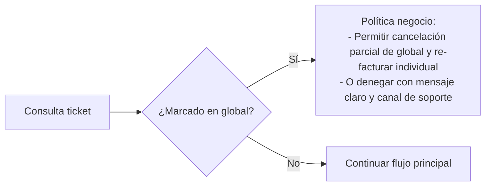

# Portal de Autofacturación (CFDI 4.0) – Diagrama de Flujo Detallado

Este documento muestra el flujo end-to-end para que un cliente final emita su factura electrónica a partir de un ticket de venta, incluyendo validaciones fiscales, seguridad, antifraude, manejo de errores, y post-emisión.

Leyenda de actores:
- Cliente: Navegador del usuario final
- Portal: Frontend + Backend del portal de autofacturación
- POS/ERP: Sistemas internos donde reside la venta/ticket
- PAC: Proveedor Autorizado de Certificación
- Email/CDN/Storage: Entrega de archivos y correos

## Flujo principal: emisión de CFDI por ticket

```mermaid
flowchart TD
  %% Subgraphs (actores)
  subgraph A[Cliente]
    A0[Abre URL del Portal] --> A1[Lee Aviso de Privacidad<br/>y Términos]
    A1 --> A2[Ingresa identificadores del ticket<br/>- No. Ticket (o QR token)<br/>- Fecha compra<br/>- Total exacto<br/>- Sucursal]
  end

  subgraph B[Portal (Edge)]
    B0[WAF/CDN y TLS] --> B1[Anti-bot: reCAPTCHA/hCaptcha v3<br/>Rate limiting IP/huella]
  end

  subgraph C[Portal (Backend)]
    C0[Validar formato y normalizar entrada<br/>(sanitización, trimming, locales)] --> C1[Verificar ventana de facturación<br/>(política negocio)]
    C1 --> C2{¿Entrada vía QR firmado?}
    C2 -- Sí --> C3[Verificar firma del token (JWT/HMAC)<br/>y claims: ticketId, total, fecha, sucursal]
    C2 -- No --> C4[Aplicar 2FA de ticket:<br/>coinciden ticket + fecha + total + sucursal]
    C3 --> C5[Construir consulta a POS/ERP]
    C4 --> C5

    C5 --> C6[Consulta ticket a POS/ERP]
    C6 --> C7{¿Ticket existe?}
    C7 -- No --> E1[Rechazo: Ticket no encontrado<br/>+ guía para revisar datos]
    C7 -- Sí --> C8[Validar estado: no devuelto/cancelado,<br/>moneda soportada, sucursal vigente]
    C8 --> C9{¿Ticket ya facturado?}
    C9 -- Sí --> E2[Detener: ya facturado. Ofrecer re-descarga<br/>(validar RFC y token)]
    C9 -- No --> C10[Validar elegibilidad:<br/>no incluido en factura global,<br/>dentro del periodo permitido]

    C10 --> C11[Mapear datos de venta a CFDI:<br/>líneas, claves ProdServ/Unidad,<br/>impuestos (IVA/IEPS), descuentos]
    C11 --> C12[Derivar forma de pago (c_FormaPago)<br/>y método (PUE/PPD) desde POS]
    C12 --> C13[Calcular importes/impuestos<br/>con precisión 6 decimales y redondeo]
    C13 --> C14[Preparar estado de sesión:<br/>ticket hash + intento + idempotencia]

    C14 --> C15[Pedir datos fiscales del receptor<br/>(RFC, Nombre/Razón, Régimen, CP, UsoCFDI, email)]
    C15 --> C16[Validaciones locales:<br/>formato RFC/dígito, CP válido,<br/>catálogos SAT vigentes]
    C16 --> C17[Validar combinatorias:<br/>Régimen vs UsoCFDI]
    C17 --> C18{¿Datos válidos?}
    C18 -- No --> E3[Errores de captura: marcar campos,<br/>sugerir corrección y reintentar]
    C18 -- Sí --> C19[Construir pre-CFDI 4.0 (XML en memoria)<br/>Emisor + Receptor + Conceptos + Impuestos]

    C19 --> C20[Reglas de negocio:<br/>por ticket 1 factura, límites intentos,<br/>idempotencia por (ticket, RFC)]
    C20 --> C21[Resumen para confirmación:<br/>mostrar totales, impuestos, método/forma,<br/>datos receptor, aviso privacidad]
  end

  subgraph A2[Cliente (Confirmación)]
    A3[Confirma y acepta términos] --> A4[Solicita timbrado]
  end

  subgraph C2[Portal (Timbrado)]
    C22[Sellar CFDI con CSD del emisor<br/>(en HSM/Secret Manager)] --> C23[Llamar PAC: Timbrado CFDI 4.0<br/>(sandbox/prod, timeouts/retries)]
    C23 --> C24{¿PAC responde éxito?}
    C24 -- No --> C25[Clasificar error PAC:<br/>- Validación SAT (catálogo, RFC, totales)<br/>- Red/transitorio (retry con jitter)<br/>- Credenciales/certificado]
    C25 --> C26{¿Error recuperable?}
    C26 -- Sí --> C27[Reintento controlado<br/>con idempotencia y límite]
    C27 --> C23
    C26 -- No --> E4[Mostrar causa al usuario<br/>y pasos de corrección; registrar incidente]
    C24 -- Sí --> C28[Guardar CFDI timbrado (XML)<br/>UUID, selloSAT, noCertSAT, fechaTimbrado]
    C28 --> C29[Generar PDF representación impresa<br/>con QR oficial]
    C29 --> C30[Persistir en almacenamiento cifrado<br/>(XML/PDF) + metadatos]
    C30 --> C31[Registrar auditoría/trazas/métricas]
  end

  subgraph D[Entrega]
    D0[Generar enlaces firmados de descarga<br/>(expiran, one-time si aplica)] --> D1[Enviar email transaccional<br/>(XML+PDF adjuntos o links)]
    D1 --> D2[Mostrar pantalla de éxito<br/>con links y UUID]
  end

  %% Conexiones entre subgraphs
  A2 --> B1 --> C0
  E1 -. respuesta a cliente .-> A2
  E2 -. re-descarga .-> A2
  E3 -. corrección .-> A2
  E4 -. mostrar error .-> A2
  A4 --> C22
  C31 --> D0
  D2 --> A[Fin feliz]

  %% Notas
  classDef error fill:#ffe6e6,stroke:#ff4d4f,color:#a8060a;
  class E1,E2,E3,E4 error;
```

Notas clave:
- Idempotencia: toda emisión se protege con una clave única por (ticket, RFC) para evitar duplicados.
- Antifraude: captcha invisible y rate limiting desde el primer request; si hay patrones anómalos, elevar desafío.
- Datos fiscales: se validan antes de timbrar para minimizar rechazos (catálogos SAT locales actualizados).

---

## Flujos alternos y excepciones

### A) Re-descarga segura de CFDI ya emitido

```mermaid
flowchart LR
  R0[Cliente: "Ya facturado"] --> R1[Portal: Solicitar RFC + token de ticket o email]
  R1 --> R2[Verificar match con CFDI emitido<br/>(ticketId, RFC, hash)]
  R2 --> R3{¿Coincide?}
  R3 -- No --> R4[Denegar y registrar intento]
  R3 -- Sí --> R5[Emitir links firmados temporales<br/>para XML/PDF]
  R5 --> R6[Email opcional de reenvío]
```

### B) Ticket incluido en factura global



### C) Cancelación y sustitución

```mermaid
flowchart TD
  K0[Cliente solicita corrección] --> K1[Portal Backoffice valida motivos SAT]
  K1 --> K2[Iniciar cancelación en PAC/SAT]
  K2 --> K3{¿Requiere aceptación del receptor?}
  K3 -- Sí --> K4[Esperar ventana de aceptación<br/>y notificar estatus]
  K3 -- No --> K5[CFDI cancelado]
  K4 --> K6{¿Aceptado?}
  K6 -- No --> K7[Cancelar proceso y notificar]
  K6 -- Sí --> K5
  K5 --> K8[Si aplica, emitir CFDI sustituto<br/>(relación 04)]
  K8 --> K9[Entregar nuevo XML/PDF y actualizar links]
```

### D) Errores frecuentes y manejo

- RFC o nombre no coinciden con constancia: informar al usuario, permitir corrección; si PAC ofrece validador de constancia, usarlo con consentimiento.
- Totales/impuestos no cuadran: revisar motor de impuestos del POS; bloquear emisión y alertar al equipo.
- Certificado vencido o credenciales PAC: detener emisión, alertar on-call, conmutar a PAC secundario si existe.
- Intermitencia PAC: reintentos exponenciales con jitter, colas diferidas; no duplicar CFDI.

---

## Controles de seguridad y cumplimiento (puntos de inserción)

- WAF/CDN: bloqueo de bots, IP reputation, reglas anti-enumeración en endpoints de ticket.
- Captcha adaptativo: elevar desafío según riesgo (por IP/UA/huella).
- Tokens de ticket: preferir QR con firma; expirar y ligar a monto/fecha/sucursal.
- Secretos: CSD .cer/.key y contraseñas en HSM o Secret Manager con RBAC y rotación.
- Logging: sin PII sensible; correlación por IDs técnicos; trazas distribuidas.
- Descargas: URLs firmadas con expiración corta; una sola descarga si se requiere mayor control.

---

## Métricas y observabilidad

- Tasa de éxito de timbrado (%), causas de rechazo (top N), latencia PAC.
- Intentos bloqueados por antifraude, errores por validación de catálogos, duplicados prevenidos.
- Re-descargas servidas y tiempos de expiración de links.
- Alertas: certificados por vencer, fallo en actualización de catálogos SAT, incremento anómalo de rechazos.
