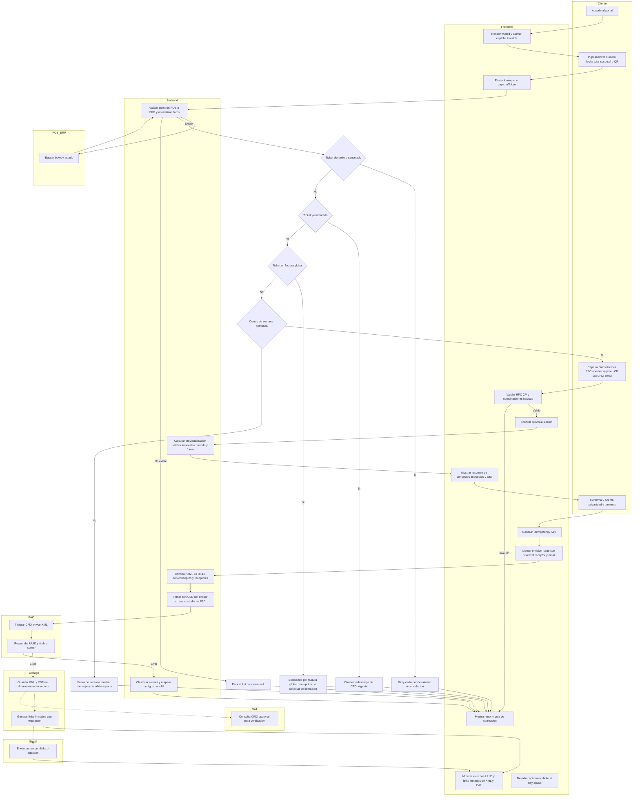
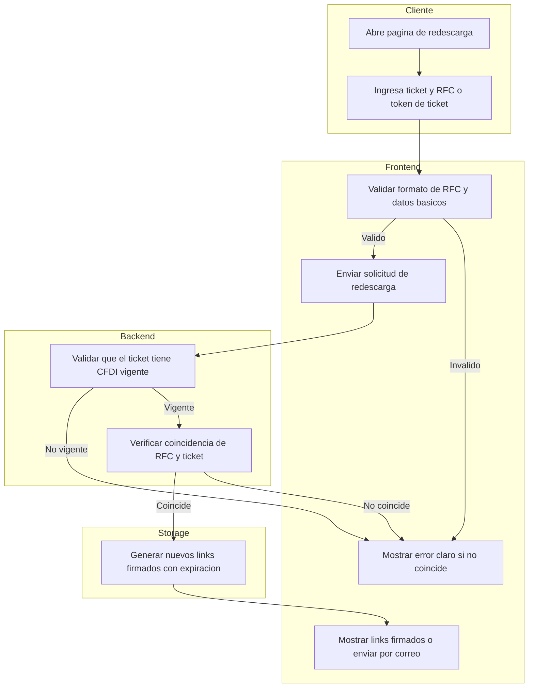
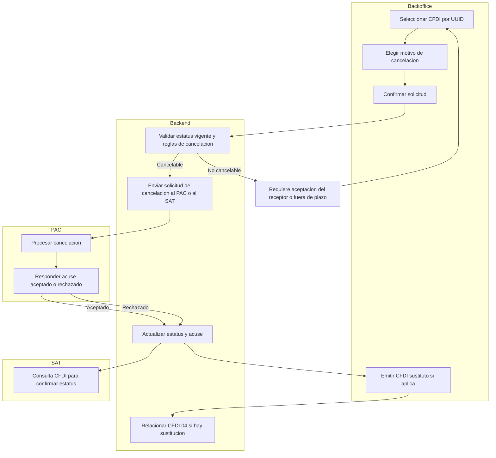

# Diagrama de flujo del portal de autofacturacion

A continuación se presentan diagramas Mermaid compatibles con GitHub. No hay comillas ni parentesis en labels. Cada subflujo cubre escenarios clave.

## Configuración de Git

Para evitar el error "fatal: Need to specify how to reconcile divergent branches" al hacer pull, configura tu repositorio local:

```bash
# Opción 1: Usar el archivo de configuración incluido
# (El path es relativo al directorio .git)
git config --local include.path ../.gitconfig

# Opción 2: Configurar manualmente (recomendado)
git config pull.rebase false  # usa merge al hacer pull
```

O para todos tus repositorios:
```bash
git config --global pull.rebase false
```

## Flujo principal desde ticket hasta entrega



Leyenda rapida
- Ya facturado significa que el ticket tiene un CFDI vigente con UUID asignado
- En factura global significa que el ticket fue incluido en un CFDI a publico en general y se bloquea la emision individual
- Ventana permitida es el periodo definido por negocio para poder emitir la factura individual
- Idempotency Key previene facturas duplicadas por doble clic

## Flujo de re descarga de CFDI



Mensajes recomendados
- Si no coincide RFC con el CFDI vigente mostrar mensaje de seguridad sin revelar datos
- Si el link expira permitir regenerar con validacion de ticket y RFC

## Flujo de cancelacion y sustitucion desde backoffice



Notas
- Cancelacion aceptada pasa a estatus cancelado
- Si hubo error de datos del receptor se emite un CFDI sustituto y se relaciona con clave 04
- El portal publico no expone cancelacion esto se opera en backoffice
